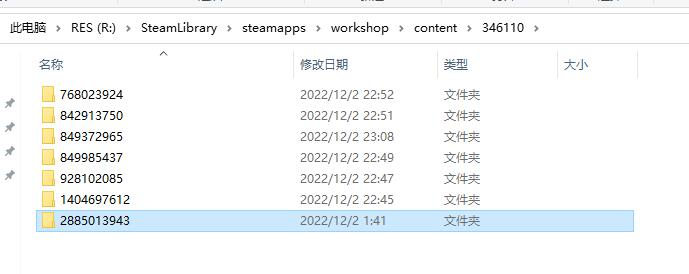
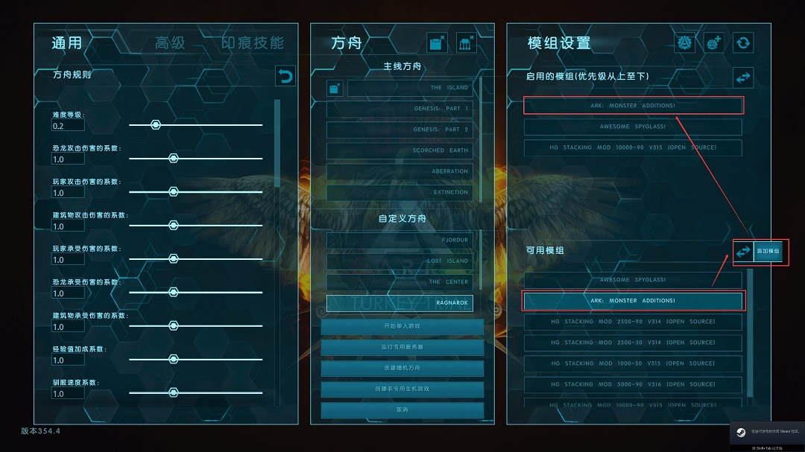
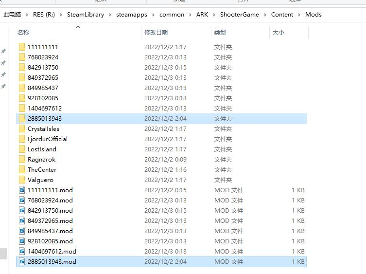
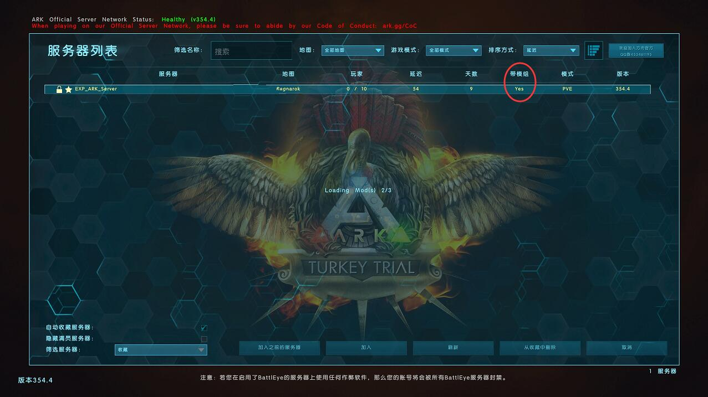
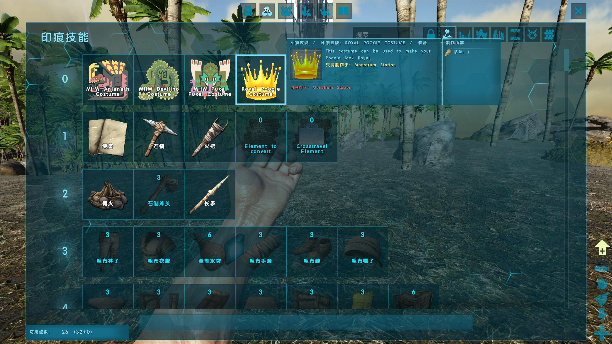

# 在 ARK 安装 MOD 指引

------

## 0x10 服务端安装 MOD 方法

1. 先到 steam 的 ARK 创意工坊订阅 MOD（订阅后会自动下载），这里以 `ARK: Monster Additions!` 为例，它的 MOD ID 为 2885013943


2. 订阅后会在 steam 的 workshop 目录找到 `SteamLibrary\steamapps\workshop\content\346110`（346110 就是 ARK 游戏客户端的 APP ID）



3. 但这仅仅是下载回来，还未安装到 ARK 里面，所以在 ARK 的 MOD 安装目录下 `SteamLibrary\steamapps\common\ARK\ShooterGame\Content\Mods` 是看不到这个 MOD 的
4. 此时需要先开启一次游戏，进入【主机/单人】模式，在右下角的【可用模组】中选中刚刚订阅的模组，点击【添加模组】按钮（不需要创建游戏）



5. 然后再打开 ARK 的 MOD 安装目录 `SteamLibrary\steamapps\common\ARK\ShooterGame\Content\Mods`，就可以看到这个模组了（一个以模组 ID 命名的文件夹和 `*.mod` 文件）：




6. 复制这个文件夹和 `*.mod` 文件，粘贴到 ARK 服务端 `./volumes/steam/games/ark/ShooterGame/Content/Mods` 的目录下，就把这个 MOD 安装到服务端了
7. 重启 ARK，启动命令需要指定 MOD ID 的参数: `bin/run_ark.[sh|ps1] -i ${MOD_ID}`（用逗号分隔多个 MOD ID）
8. 进入游戏，【加入线上方舟】，当看见【带模组】标记为 `Yes` 时，说明 MOD 已激活






## 0x20 客户端安装 MOD 方法

客户端安装就相对简单得多了：只要加入服务器，就会自动安装服务器当前激活的 MOD 了。


## 0x30 误区

正常途径下，官方是建议通过 [SteamCMD](https://developer.valvesoftware.com/wiki/SteamCMD) 自动下载并管理 MOD 的，只需要根据 [ARK Server configuration](https://ark.fandom.com/wiki/Server_configuration) 去添加配置：

1. 在启动服务器时添加 `-automanagedmods` 选项
2. 在 `Game.ini` 中添加：

```
[ModInstaller]
ModIDS=<value1>
ModIDS=<value2>
ModIDS=<value3>
```

3. 在 `GameUserSettings.ini` 的 `[ServerSettings]` 下面添加：

```
ActiveMods=<value1>,<value2>,<value3>
```

这套方案被各路大神未经验证就广泛传播，但是事实上这套方案有两个前提条件：

1. 服务器在海外，否则无法使用 [SteamCMD](https://developer.valvesoftware.com/wiki/SteamCMD)
2. `-automanagedmods` 选项事实上只支持 windows （虽然声明是全平台适用）

所以在国内的服务器、而且还是 Linux 部署的，就完全不起作用了，往往在第 2 步配置 `Game.ini` 后服务端就起不来。

------

其实真正的解法，只需要按照前面说的，在服务端安装 MOD，然后启动 ARK 时，带两个参数即可：

- `?GameModIds=${MOD_IDS}`: 告诉 ARK 需要加载哪些已安装的 MOD （等价于前面 `Game.ini` 的配置）
- `?ActiveMods=${MOD_IDS}`: 告诉 ARK 需要激活哪些 MOD （等价于前面 `GameUserSettings.ini` 的配置）

> 这两个参数已经封装在 [bin/ark.sh](./bin/ark.sh) 中，所以这里只需要使用 `bin/run_ark.[sh|ps1]` 脚本启动服务器时，通过 `-i ${MOD_IDS}` 按需指定即可


## 参考文档

- 《[Help installing Ark mods on Linux server](https://survivetheark.com/index.php?/forums/topic/497784-help-installing-ark-mods-on-linux-server/)》
