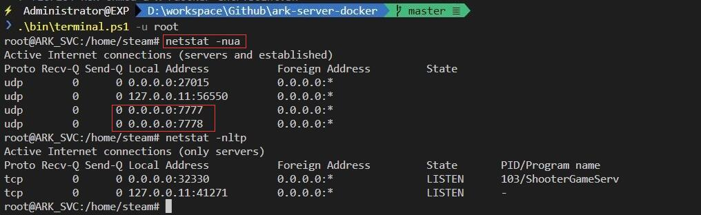
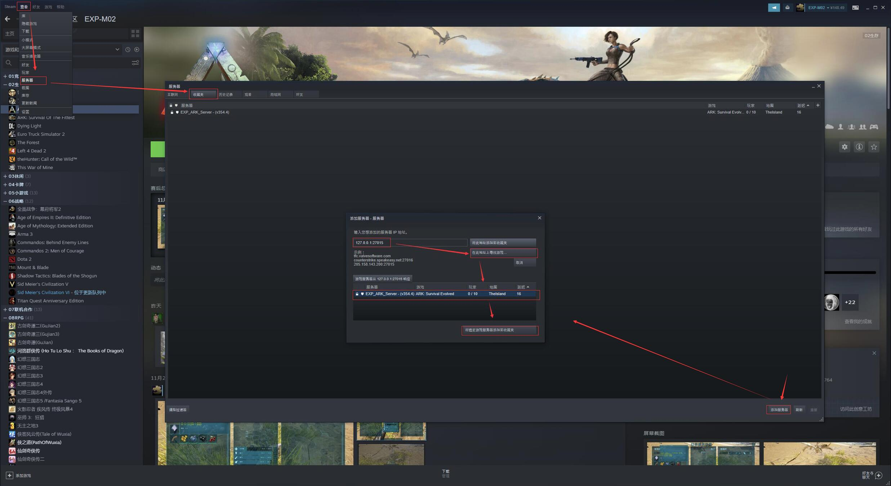
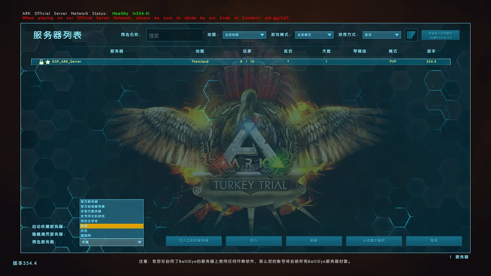
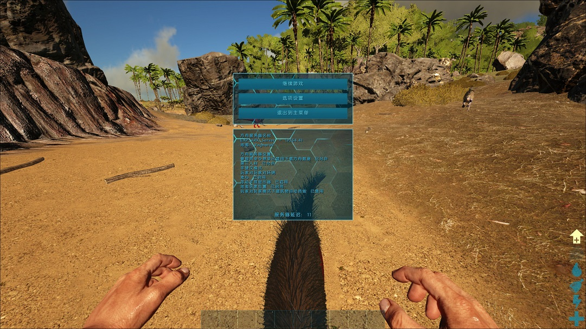
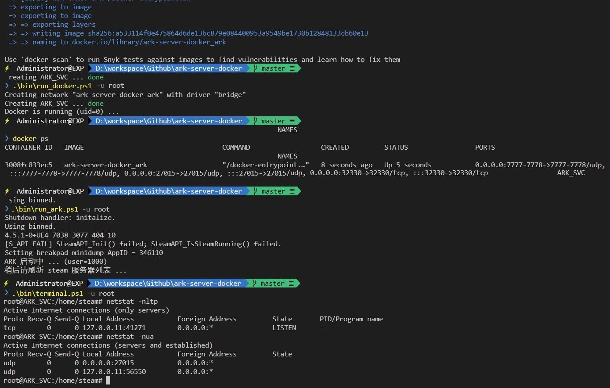

# ARK-server-docker

> docker 一键部署 ARK（方舟-生存进化）

------

## 0x00 介绍

此为 steam 版 ARK 的 docker 服务端，可用于搭建私人联机服务器。

搭建过程只用到官方原生的 [SteamCMD docker](https://hub.docker.com/r/cm2network/steamcmd/) 和 [ARK Server configuration](https://ark.fandom.com/wiki/Server_configuration) 配置。

> 此工程没有引入网上其他比较热门的 ARK 部署工具，所以它们的配置项均不适用


## 0x10 运行环境

 


## 0x10 硬件要求

| 硬件 | 最低配置 | 推荐配置 | 流畅配置 |
|:---:|:---:|:---:|:---:|
| CPU | 2C | 4C | 8C|
| 内存 | 6G | 8G | 16G |
| 虚拟内存 | 4G | 4G | 4G |
| 硬盘 | 50G | 100G | 100G |

> ARK 当前版本的服务端大小为 18812537984 bytes，约 18G，因为要从 steam 服务器下载，所以国内非常慢甚至连接不上。建议使用香港或韩国的云主机，从海外下载速度较快且不会被 GFW 拦截、国内也有不错的访问速度


## 0x30 部署步骤

### 0x31 预操作

以下命令使用 root 用户执行: 

1. 安装 [python3](https://www.python.org/downloads/)、 docker、 docker-compose、 git
2. 设置虚拟内存（推荐 4G）
3. 创建 steam 用户: `adduser steam`
4. 添加 steam 用户到 docker 组: `usermod -aG docker steam`
5. 切换到 steam 用户: `su - steam`

之所以要添加 steam 用户，是因为下面构建的 [SteamCMD docker](https://hub.docker.com/r/cm2network/steamcmd/) 镜像内强制使用了 steam 用户。

由于 docker 需要从宿主机挂载服务端的游戏目录，如果宿主机使用 root 用户挂载，会导致 docker 内的用户没有权限而无法读写。

所以宿主机需要创建一个非 root 用户、而为了方便起见就用了相同的 steam 用户。

> **之后的所有命令必须使用 steam 用户执行**


### 0x31 部署镜像

1. 下载此仓库: `git clone --depth 1 --branch master https://github.com/lyy289065406/ark-server-docker.git`
2. 进入根目录: `cd ark-server-docker`
3. 构建镜像: `bin/build.[sh|ps1]`（镜像中不含游戏本体，只有用于下载游戏的 [SteamCMD](https://developer.valvesoftware.com/wiki/SteamCMD) ）
4. 运行镜像: `bin/run_docker.[sh|ps1]`

> 如果不想自己构建镜像，可以使用现成的镜像: [expm02/ark-server-docker:latest](https://hub.docker.com/repository/docker/expm02/ark-server-docker)


### 0x32 部署 ARK 服务端（SteamCMD 通道）

安装游戏: `bin/install_game.[sh|ps1]`，此为命令执行后会打开 [SteamCMD](https://developer.valvesoftware.com/wiki/SteamCMD) 交互终端，依次输入：

1. 创建 ARK 游戏目录: `force_install_dir /home/steam/games/ark`
2. 匿名登录 steam : `login anonymous`
3. 下载 ARK 服务端: `app_update 376030`（游戏约 18G，超级慢而且可能失败）

> `app_update 376030` 可能会因为网络原因多次失败，重新执行即可，会断点下载

<details>
<summary>关于 steam app id 376030 ...</summary>
<br/>

在 steam 中每个游戏都有一个唯一且固定的 APP ID，可以在商店页面地址中查看（跟在 `/app/` 后的数字）：

| APP ID | 游戏名称 | 描述 |
|:---:|:---|:---|
| 346110 | ARK: Survival Evolved | ARK 游戏客户端 |
| 376030 | ARK: Survival Evolved Dedicated Server | ARK 专用服务端 |

</details>


### 0x32 部署 ARK 服务端（Github 通道）

当 [SteamCMD](https://developer.valvesoftware.com/wiki/SteamCMD) 通道无法安装成功时，可使用此方法（否则应该跳过）：

<details>
<summary>展开</summary>
<br/>

1. 创建 [Github](https://github.com/) 账号（若已有则跳过）
2. 配置 [Github SSH](https://docs.github.com/en/authentication/connecting-to-github-with-ssh)
3. Frok 此仓库（目的是使用 SSH 下载）: `https://github.com/lyy289065406/ark.git`
4. 创建并切换工作目录: `volumes/steam/games`
5. 使用 SSH 下载到该目录: `git clone --depth 1 --branch master git@github.com:${你的用户名}/ark.git`
6. 切换工作目录: `cd ark`
7. 解压大文件: `bin/unpack_7zip.[sh|ps1]`（需要预装 [7-zip](https://www.7-zip.org/) 命令行）

> 更多细节详见 [ARK](https://github.com/lyy289065406/ark.git) 的 [README.md](ttps://github.com/lyy289065406/ark.git) 说明

</details>


## 0x40 暴露服务

| 协议 | 端口 | 是否必要 | 用途 |
|:---:|:---:|:---:|:---|
| UDP | 7777 | 是 | 服务端对玩家开放的端口，已硬编码不可修改 |
| UDP | 7778 | 是 | 同上 |
| UDP | 27015 | 是 | 被 steam 服务器列表搜索服务端所用的端口，已硬编码不可修改 |
| TCP | 32330 | 否 | RCON 服务器在线管理工具的端口 |

以上端口均需要：

- docker 映射到宿主机（已配置到 [docker-compose.yml](./docker-compose.yml)）
- 主机防火墙准入（Linux 若没有安装 iptables 则不需要）
- 云主机配置安全组策略


## 0x50 运行 ARK 服务端

1. 启动 ARK 服务端: `bin/run_ark.[sh|ps1] -p ${服务器密码}`（默认密码已经公开，建议重新指定）
  - ARK 启动约需 10 ~ 15 分钟，如果想验证是否启动成功，可以进入 docker 终端: `bin/terminal.[sh|ps1]`
  - 输入命令 `netstat -nua` 查看当前监听的 UDP 端口，只要把 7777 和 7778 端口刷出来则表示已成功启动



2. steam 添加服务器: 
  - 查看 `->` 服务器 `->` 收藏夹
  - 添加服务器 `->` 填写 `${云主机公网 IP}:27015` -> 在此地址上寻找游戏 ...
  - 当在列表中看到自己的服务器名字后，点击 将选定游戏服务器添加至收藏夹



3. steam 开始游戏:
  - 加入线上方舟
  - 筛选服务器 `->` 收藏
  - 加入 `->` 输入 `服务器密码`
  - 和小伙伴愉快游戏吧 ~ 






## 0x60 关于定制 ARK 启动配置

通过 `bin/run_ark.[sh/ps1]` 实际上是调用了 ARK 的核心启动脚本 [`bin/ark.sh`](./bin/ark.sh)，它默认配置了一些常用配置项：

| 分类 | 配置项 | 默认值 | 用途 |
|:---:|:---|:---|:---|
| 可控 | SessionName | EXP_ARK_Server | 在 steam 服务器列表上看到的名称 |
| 可控 | MaxPlayers | 10 | 能进入服务器的最大玩家数量 |
| 可控 | ServerPassword | EXP123456 | 玩家进入服务器时需要提供的密码 |
| 可控 | ServerAdminPassword | ADMIN654321 | 管理员通过 RCON 在线管理服务器的密码 |
| 可控 | ServerMap | TheIsland | 服务器地图 |
| 可控 | GameModIds |   | 服务器已安装支持的 MOD ID 列表 |
| 可控 | ActiveMods |   | 服务器当前激活的 MOD ID 列表 |
| 可控 | DifficultyOffset | 0.2 | 游戏难度，最大值 3 。难度越高、怪物等級越高 |
| 可控 | HarvestAmountMultiplier | 1.0 | 资源获得倍率，最大值 3 。<br/>影响行为包括：砍伐树木、采摘浆果、分解尸体、开采岩石等 |
| 可控 | TamingSpeedMultiplier | 1.0 | 驯服恐龙倍率，最大值未知。此项越大、驯服速度越快 |
| 可控 | ResourcesRespawnPeriodMultiplier | 1.0 | 资源重生倍率。此项越小、重生速率越快。资源包括：树木、岩石、灌木等 |
| 可控 | CropGrowthSpeedMultiplier | 1.0 | 作物生长倍率。此项越大、作物成长越快 |
| 可控 | XPMultiplier | 1.0 | 指定玩家、部落和恐龙在各种行动中获得的经验获得倍率。此项越大、获得经验越多 |
| 硬编码 | serverPVE | True | PVE 模式 |
| 硬编码 | RCONEnabled | True | 是否启用 RCON 服务器在线管理工具 |
| 硬编码 | RCONPort | 32330 | RCON 的服务端口 |
| 硬编码 | servergamelog |  | 记录 Admin 在 RCON 的操作日志 |
| 硬编码 | ShowFloatingDamageText | True | 类似 RPG 游戏浮现伤害文字 |
| 硬编码 | ServerAutoForceRespawnWildDinosInterval |  | 服务器重启时强制刷新野生恐龙 |
| 硬编码 | AutoDestroyStructures |  | 随着时间推移，自动销毁附近废弃的部落建筑 |
| 硬编码 | NoBattlEye |  | 不启动 BattleEye 反作弊工具 |
| 硬编码 | crossplay |  | 允许跨平台（Epic 和 Steam 互通） |
| 硬编码 | server |  | 作为服务器启动（可有可无） |
| 硬编码 | log |  | 记录服务器的游戏日志 |


启动过一次服务端后，会在 `ShooterGame/Saved/Config/LinuxServer/` 目录下自动创建 `GameUserSettings.ini` 和 `Game.ini` 配置文件，可以参考 [ARK Server configuration](https://ark.fandom.com/wiki/Server_configuration) 的参数说明修改这些配置文件。

除了上表的**可控**配置项，均可在配置文件中修改。否则需要修改脚本 [`bin/ark.sh`](./bin/ark.sh)。

1. 修改完成后，需要停止镜像: `bin/stop.[sh|ps1]`
2. 如果修改过 [`bin/ark.sh`](./bin/ark.sh)，还需要重新构建镜像: `bin/build.[sh|ps1]`
3. 再次运行镜像: `bin/run_docker.[sh|ps1]`
4. 然后运行 ARK 服务端: `bin/run_ark.[sh|ps1]`


## 0x70 重启服务

只有第一次需要执行上述的步骤，配置好之后，只需要简单 3 条命令即可：

1. 停止镜像: `bin/stop.[sh|ps1]`
2. 运行镜像: `bin/run_docker.[sh|ps1]`（参数见脚本内）
3. 运行 ARK: `bin/run_ark.[sh|ps1]`（参数见脚本内）

> 当服务端已经通过 SteamCMD 下载完成后，其实已经不需要 steam 用户了。此时若需要使用 root 用户，可以在上述命令后面添加 `-u root`




## 0x80 迁移服务

服务启动后会自动生成以下 3 个目录：

- 配置目录: `./volumes/steam/games/ark/ShooterGame/Saved/Config/*`
- 存档目录: `./volumes/steam/games/ark/ShooterGame/Saved/SavedArks/*`
- 日志目录: `./volumes/steam/games/ark/ShooterGame/Saved/Logs/*`

迁移前可以执行脚本 `bin/backup.[sh|ps1]` 将其备份到 [backup](./backup) 目录。

建议设置 `crontab -e` 定时任务自动备份 :

```
# 每小时备份一次存档
# 其中把 ${ARK_DIR} 换成实际 ark-server-docker 工程的绝对路径
# 例如: /home/steam/workspace/github/ark-server-docker
0 */1 * * * cd ${ARK_DIR} && bin/backup.sh > /tmp/backup.log
```

> `bin/backup.[sh|ps1]` 脚本会自动删除 3 天前的存档记录，避免服务器硬盘溢出


## 0x90 安装 MOD

> 详见 《[在 ARK 安装 MOD 指引](./AddMod.md)》

当前默认已安装的 MOD 如下，使用 `bin/run_ark.[sh|ps1]` 脚本启动服务器时，通过 `-i ${MOD_IDS}` 按需指定即可：

| 订阅 | id | name | 分类 | 用途 |
|:---:|:---:|:---|:---:|:---|
| [Link](https://steamcommunity.com/sharedfiles/filedetails/?id=1404697612) | 1404697612 | `Awesome SpyGlass!` | 功能 | A+ 望远镜：超级神器，辅助瞄准、查看情报等 |
| [Link](https://steamcommunity.com/sharedfiles/filedetails/?id=849372965) | 849372965 | `HG Stacking Mod 1000-90` | 功能 | 物品叠加上限 `+1000` 负重 `-50%` |
| [Link](https://steamcommunity.com/sharedfiles/filedetails/?id=768023924) | 842913750 | `HG Stacking Mod 2500-50` | 功能 | 物品叠加上限 `+2500` 负重 `-50%` |
| [Link](https://steamcommunity.com/sharedfiles/filedetails/?id=768023924) | 768023924 | `HG Stacking Mod 2500-90` | 功能 | 物品叠加上限 `+2500` 负重 `-90%` |
| [Link](https://steamcommunity.com/sharedfiles/filedetails/?id=849985437) | 849985437 | `HG Stacking Mod 5000-90` | 功能 | 物品叠加上限 `+5000` 负重 `-90%` |
| [Link](https://steamcommunity.com/sharedfiles/filedetails/?id=928102085) | 928102085 | `HG Stacking Mod 10000-90` | 功能 | 物品叠加上限 `+10000` 负重 `-90%` |
| [Link](https://steamcommunity.com/sharedfiles/filedetails/?id=1211297684) | 1211297684 | `HG Multi Storage Box V4.9` | 建筑 | 方便的储物箱（容量更大） |
| [Link](https://steamcommunity.com/sharedfiles/filedetails/?id=751991809) | 751991809 | `Death Recovery Mod` | 建筑 | 墓碑：死亡后快速回收背包 |
| [Link](https://steamcommunity.com/sharedfiles/filedetails/?id=731604991) | 731604991 | `Structures Plus (S+)` | 建筑 | 摆放辅助、重叠地基等 |
| [Link](https://steamcommunity.com/sharedfiles/filedetails/?id=893904615) | 893904615 | `OzoCraft 1.7` | 建筑 | 工作台：可以生产特有的建筑材料 |
| [Link](https://steamcommunity.com/sharedfiles/filedetails/?id=889745138) | 889745138 | `Awesome Teleporters!` | 建筑 | 传送门：可以在任何位置放置传送点 |
| [Link](https://steamcommunity.com/sharedfiles/filedetails/?id=722649005) | 722649005 | `Redwoods Anywhere` | 生物 | 植树造林：可以在任何地方种植红杉 |
| [Link](https://steamcommunity.com/sharedfiles/filedetails/?id=2885013943) | 2885013943 | `ARK: Monster Additions!` | 生物 | 添加【怪物猎人:世界】中出现的怪物 |
| [Link](https://steamcommunity.com/sharedfiles/filedetails/?id=902616446) | 902616446 | `Dino Colourizer!` | 功能 | 可以给恐龙可上色以标记位置 |
| [Link](https://steamcommunity.com/sharedfiles/filedetails/?id=895711211) | 895711211 | `Classic Flyers` | 功能 | 恢复飞行单位可以加速度属性 |
| [Link](https://steamcommunity.com/sharedfiles/filedetails/?id=1232362083) | 1232362083 | `Wardrobe Skins` | 外观 | 新增大量个性的服装 |
| [Link](https://steamcommunity.com/sharedfiles/filedetails/?id=618916953) | 618916953 | `Cute Hair (v6.1)` | 外观 | 超过 200 种发型 |


## 0xA0 定制个性化脚本

虽然用 `bin/run_ark.[sh|ps1]` 脚本可以一键启动，但是定制个性化服务时的启动参数还是太多，不方便记忆。

所以可以自行再添加一些封装脚本在 [`sbin`](./sbin/) 目录（此目录不会把文件同步到 Git 仓库），可以参考样例 [`sbin/onekey_demo.sh`](./sbin/onekey_demo.sh)：

```bash
#!/bin/bash
# sbin/onekey_demo.sh
#------------------------------------------------
# 示例：sbin/onekey_demo.sh 
#           [-s ${ServerName}]                  # 服务器名称（在 steam 服务器上看到的）
#           [-m ${MapName}]                     # 地图名
#           [-c ${PlayerAmount}]                # 最大玩家数
#           [-p ${ServerPassword}]              # 服务器密码
#           [-a ${AminPassword}]                # 管理员密码
#           [-d ${Difficulty}]                  # 游戏难度
#           [-h ${HarvestAmount}]               # 资源获得倍率
#           [-t ${TamingSpeed}]                 # 驯服恐龙倍率
#           [-r ${ResourcesRespawnPeriod}]      # 资源重生倍率
#           [-g ${CropGrowthSpeed}]             # 作物生长倍率
#           [-x ${XPMultiplier}]                # 经验获得倍率
#           [-i ${ModIds}]                      # 地图 MOD ID 列表，用英文逗号分隔
#------------------------------------------------

# 启动容器
bin/run_docker.sh -u "root"
sleep 5

# 启动 ARK 服务端
bin/run_ark.sh  -u "root" -s "EXP_ARK_Server" -p "EXP123456" -a "ADMIN654321" \
                -h "3" -t "5" -r "0.5" -g "2" -x "10" -c "10" \
                -m "Ragnarok" -i "1404697612,928102085,2885013943,751991809,731604991,889745138,902616446,1211297684,893904615,895711211,1232362083,618916953,722649005"

```


## 0xB0 升级服务端

因为 steam 的客户端会自动升级，当版本不匹配时，客户端无法找到服务端，此时需要使用 steam 通道在线升级：

1. 启动容器: `bin/run_docker.[sh|ps1]`
2. 使用 root 用户进入终端: `bin/terminal.[sh|ps1] -u root`
3. 停止游戏服务端: `ps -ef | grep -v grep | grep ark | awk '{print $2}' | xargs kill`
4. 修改游戏目录的用户权限为 steam: `chown -R steam:steam /home/steam/games/ark`
5. 退出终端: `exit`
6. 使用 steam 用户打开 steam 交互终端: `bin/install_game.[sh|ps1]`
7. 匿名登录 steam : `login anonymous`
8. 更新 ARK 服务端: `app_update 376030 validate`（游戏约 18G，超级慢而且可能失败）

> 之所以要先修改目录权限，是因为 docker 挂载卷时可能会变成仅 root 用户可读写，导致升级失败


## 0xE0 更多脚本说明

- 构建 ARK 环境镜像: `bin/build.[sh|ps1]`
- 发布 ARK 环境镜像: `bin/deploy.[sh|ps1]`
- 运行 ARK 环境容器: `bin/run_docker.[sh|ps1]`（参数见脚本内）
- 安装 ARK 服务端: `bin/install_game.[sh|ps1]`
- 运行 ARK 服务端: `bin/run_ark.[sh|ps1]`（参数见脚本内）
- 进入 ARK 环境容器终端: `bin/terminal.[sh|ps1]`（参数见脚本内）
- 停止 ARK 服务端与环境容器: `bin/stop.[sh|ps1]`
- 备份 ARK 服务端存档和配置文件: `bin/backup.[sh|ps1]`
- 清除 ARK 服务端存档、配置和日志文件: `bin/clean.[sh|ps1]`


## 0xFF 参考文档

- 《[Linux 搭建方舟服务器教程 方舟生存进化](https://www.bilibili.com/video/BV1Xp4y1n7pq/)》
- 《[在 Linux 系统下安装 steamCMD](https://blog.wehaox.com/archives/3.html)》
- 《[Linux 搭建 ARK 服务器](https://blog.csdn.net/xiaotian2333333/article/details/124733348)》
- 《[方舟生存进化: docker一键部署](https://ssst0n3.github.io/post/%E6%B8%B8%E6%88%8F/%E6%96%B9%E8%88%9F%E7%94%9F%E5%AD%98%E8%BF%9B%E5%8C%96-docker%E4%B8%80%E9%94%AE%E9%83%A8%E7%BD%B2.html)》
- 《[Dockerize ARK managed with ARK-Server-Tools](https://hub.docker.com/r/hermsi/ark-server/)》
- 《[ark-server-tools](https://github.com/arkmanager/ark-server-tools)》
- 《[arkserver](https://github.com/thmhoag/arkserver)》
